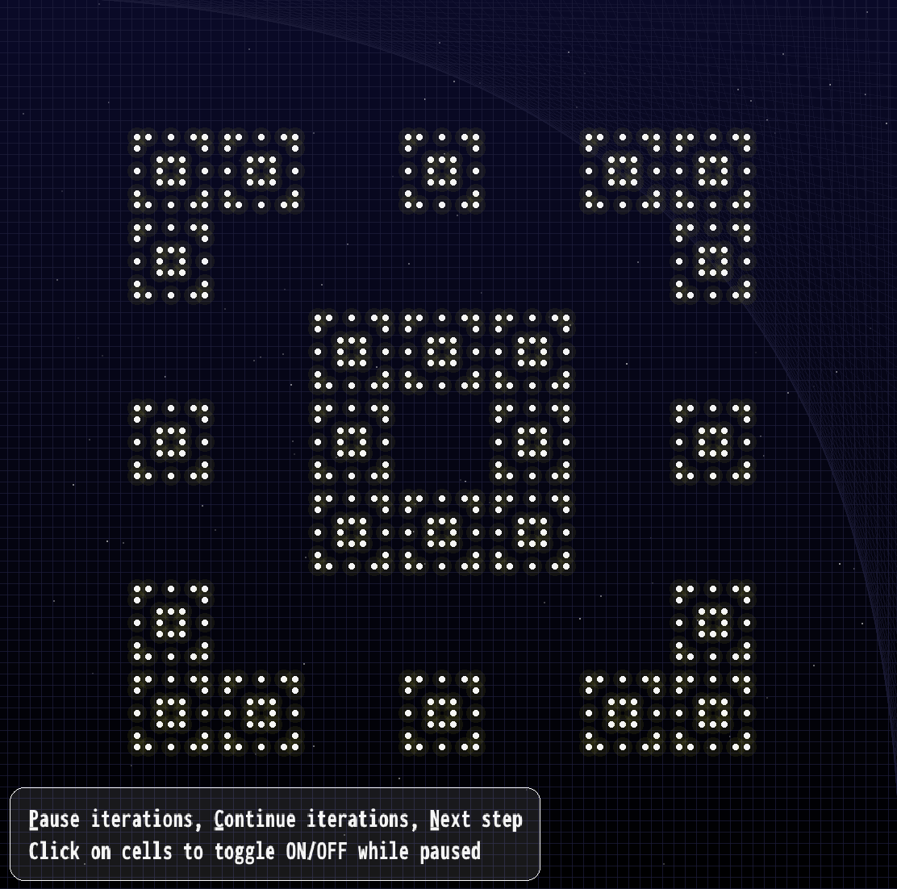

# 
Conway's Game of Life

	

---

- Implemented in C
- Running `make` builds the binary `./life`, `make optimize` builds `./life_optimized` that includes compiler optimization flags.
- Usage:
	`./life(_optimized) <initial_state> <iterations>`
- A `<initial_state>` file can contain only characters `.` and `X`, for OFF and ON cells.

## Branches
`main`
- Calculates all the steps as specified by the user, and prints out the final result into the terminal.

`print-iterations`
- Prints out all the intermediary states into the terminal while the program is going through the iterations as specified by the user.

`raylib-print`
- Similar to print-iterations, but uses the `Raylib` graphical library to create a nicer output.
- This branch also supports different transition rules - the binary accepts one more argument, `./life(_optimized) <initial_state> <iterations> <optional rule: s/r/h>`. If the additional argument is not provided, the program uses the standard B3/S23 transition rule.
- S(eeds): B2/S, R(eplicator): B1357/S1357, H(ighlife): B36/S23
